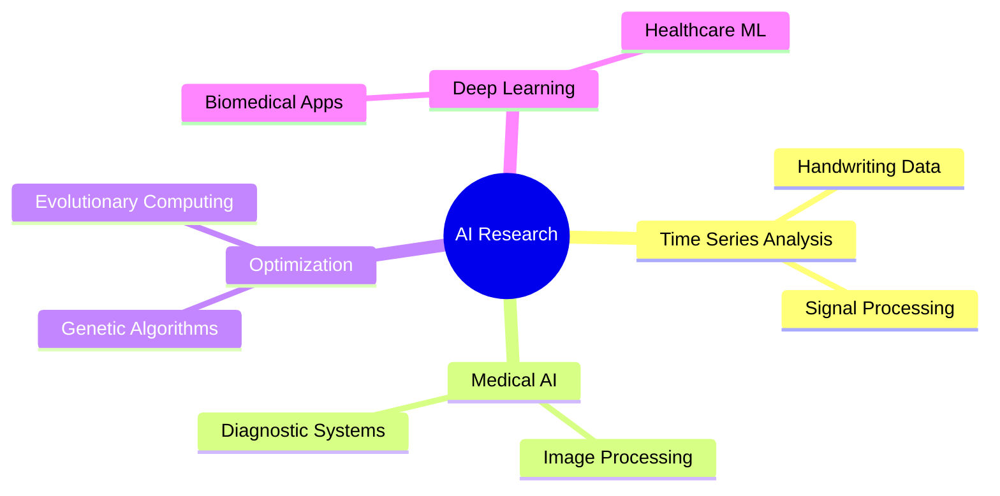

# 👋 Emanuele Nardone | AI Researcher & PhD 🧠

  

### 💭 *"Code like today's commit will be reviewed tomorrow"*

## 🎯 Research Vision

> **PhD researcher specializing in AI-driven healthcare diagnostics**, focusing on early detection of neurological conditions (Alzheimer's, Parkinson's) and Specific Learning Disabilities (SLD) through handwriting analysis. 
> 
> 🎯 **Mission**: Developing novel applications of genetic algorithms and optimisation techniques for accessible, accurate neurological assessment.
> 
> 🌟 **Impact**: Creating practical AI solutions that transform healthcare diagnostics.

 

## 🔬 Current Research Focus

<table width="100%">
<tr>
<td width="50%" valign="top">

### 🎓 Core Research Areas

- 📊 **Time Series Analysis** of Handwriting Data
- 🧬 **Medical Image Processing** & Analysis
- 🔄 **Genetic Algorithms** in Healthcare
- 🤖 **Deep Learning** for Biomedical Applications
- 📈 **Bayesian Methods** in Medical Diagnostics

</td>
<td width="50%" valign="top">

### 🚀 Active Projects

<b>🔥 Current Work</b>

- 🔍 **Spatial Handwriting Features** Extraction
- ⚙️ **Kubernetes Cluster** Creation & Deployment
- 📱 **Handwriting Acquisition System** Development
- 🔮 **Ensemble Techniques** Experimentation
- 🧬 **Genetic Programming** for Evolutionary DL
- 🎯 **Conformal Prediction** Research
- 🔗 **Causality-based Algorithms** Study

<b>📚 Learning Path</b>

- 📖 Currently Reading: **"Atomic Habits"**
- 🌱 Exploring: **DevOps & MLOps**
- 💪 Active Lifestyle: Gym (3x/week), Swimming, Hiking

</td>
</tr>
</table>

## 💻 Technology Arsenal

### 🔵 Programming Languages

### 🧠 AI/ML & Data Science

### 🛠️ Development Tools

### 🗄️ Databases

## 📊 GitHub Analytics

  
 

  

  

### 🏆 GitHub Trophies

  

## 🎓 Education & Continuous Learning

<table>
<tr>
<td width="50%">

### 📚 Academic Background
- 🎓 **PhD Student** in Artificial Intelligence
- 🏆 **Master's Degree** in Software Engineering
- 🔬 **Research Focus**: Healthcare AI & Neurological Diagnostics

</td>
<td width="50%">

### 🌱 Current Learning
- 📖 **Reading**: "Atomic Habits" by James Clear
- 🎯 **Studying**: Conformal Prediction, Causality
- 🚀 **Exploring**: DevOps, MLOps, Kubernetes

</td>
</tr>
</table>

## 🤝 Let's Connect!

  
### 💡 *"In the intersection of AI and healthcare, we don't just write code—we write hope."*

---

  
**⭐ If you find my work interesting, consider starring some repositories! ⭐**

