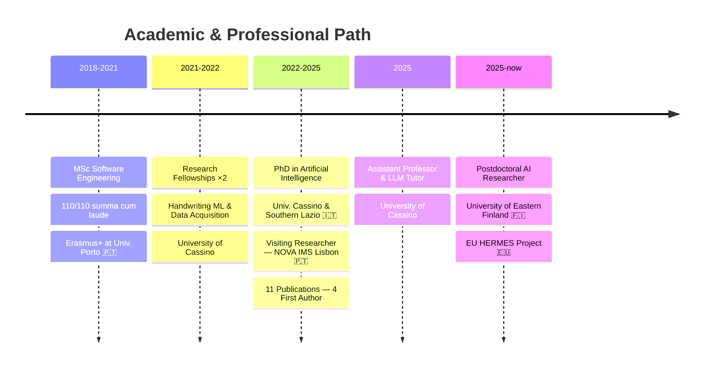

<div align="center">


[](https://git.io/typing-svg)

<br>

[](https://narden91.github.io/curriculumwebsite/)
[](https://linkedin.com/in/emanuelenardone-91)
[](https://scholar.google.com/)
[](https://twitter.com/enard91)
[](mailto:emanuele.nardone91@gmail.com)

<br>


</div>

## 🧬 About Me

```python
class EmanueleNardone:
    role         = "Postdoctoral AI Researcher"
    affiliation  = "University of Eastern Finland 🇫🇮"
    project      = "EU HERMES Project 🇪🇺"
    phd          = "PhD in Artificial Intelligence (2025)"
    alma_mater   = "University of Cassino and Southern Lazio 🇮🇹"
    
    current_focus = [
        "Raman & THz Spectroscopy AI",
        "Time Series Spectral Analysis",
        "TEM Image Computer Vision",
        "Healthcare AI & Explainability",
    ]
    
    background = [
        "Handwriting Biomarkers for Neurological Diagnosis",
        "Evolutionary Computation & Genetic Programming",
        "Bayesian Networks & Ensemble Methods",
        "Agentic AI & LLM Systems",
    ]
    
    motto = "Bridging AI research and real-world impact"
```

> **Postdoctoral Researcher** at the **University of Eastern Finland**, working on the **EU HERMES Project**. I develop AI algorithms for **Raman and THz spectroscopy** data analysis, **time series spectral analysis**, and **TEM image computer vision**. Previously, my PhD research focused on AI-driven early detection of neurodegenerative diseases (Alzheimer's, Parkinson's) and Specific Learning Disabilities through handwriting analysis, combining deep learning, evolutionary computation, and Bayesian methods with **explainability tools** for clinical decision support. Author of **11 peer-reviewed publications** including 4 as first author.

<br>

## 🔬 Research Focus

<table>
<tr>
<td width="50%" valign="top">

### 🎯 Core Domains

| Area | Details |
|------|---------|
| 🔭 **Spectroscopy AI** | Raman & THz spectroscopy data analysis with ML/DL |
| 📈 **Spectral Analysis** | Time series methods for spectral data processing |
| 🔬 **Computer Vision** | TEM image analysis & feature extraction |
| 🧠 **Healthcare AI** | Neurological disease early detection via handwriting |
| 🔍 **Explainable AI** | SHAP, attention visualisation for clinical trust |
| 🧬 **Evolutionary Computation** | Genetic algorithms & GP for feature selection |
| 🤖 **Agentic AI & LLMs** | LangChain, LangGraph, smolagents |

</td>
<td width="50%" valign="top">

### 🚀 Current Projects

- 🇪🇺 **EU HERMES Project** — AI for advanced spectroscopy
- 🔭 **Raman & THz Spectroscopy** — ML-driven data analysis pipelines
- 📊 **Time Series Spectral Analysis** — Signal processing & classification
- 🖼️ **TEM Image Analysis** — Computer vision for material characterisation
- 🌱 **Learning:** Conformal Prediction • Causal Inference • DevOps

</td>
</tr>
</table>

<br>

## 🎓 Journey


```mermaid
timeline
    title Academic & Professional Path
    2018-2021 : MSc Software Engineering
             : 110/110 summa cum laude
             : Erasmus+ at Univ. Porto 🇵🇹
    2021-2022 : Research Fellowships ×2
             : Handwriting ML & Data Acquisition
             : University of Cassino
    2022-2025 : PhD in Artificial Intelligence
             : Univ. Cassino & Southern Lazio 🇮🇹
             : Visiting Researcher — NOVA IMS Lisbon 🇵🇹
             : 11 Publications — 4 First Author
    2025      : Assistant Professor & LLM Tutor
             : University of Cassino
    2025-now  : Postdoctoral AI Researcher
             : University of Eastern Finland 🇫🇮
             : EU HERMES Project 🇪🇺
```

<br>

## 💻 Tech Stack

<details open>
<summary><b>🐍 Languages</b></summary>
<br>


</details>

<details open>
<summary><b>🧠 AI / ML / Deep Learning</b></summary>
<br>


</details>

<details>
<summary><b>📊 Data & Signal Processing</b></summary>
<br>


</details>

<details>
<summary><b>☁️ DevOps & Infrastructure</b></summary>
<br>


</details>

<details>
<summary><b>🗄️ Databases</b></summary>
<br>


</details>

<br>

## 📊 GitHub Stats

<div align="center">

<!-- 


<br> -->

[](https://git.io/streak-stats)

</div>

<br>

## 🏅 Certifications

<div align="center">


</div>

<br>

## 🌍 Beyond Code

| | |
|---|---|
| 📍 **Based in** | Joensuu, Finland 🇫🇮 |
| 🇮🇹 **From** | Italy |
| 🇵🇹 **Lived in** | Porto & Lisbon, Portugal |
| 📖 **Reading** | *Atomic Habits* — James Clear |
| 💪 **Fitness** | Gym 3×/week • Swimming • Hiking |
| 🌱 **Learning** | Conformal Prediction • Causal Inference • DevOps |
| 🗣️ **Languages** | Italian (Native) • English (B2) |

---

<div align="center">

### 🤝 Let's Collaborate

*Open to collaborations in **Spectroscopy AI**, **Healthcare AI**, **Computer Vision**, and **Explainable ML** research.*


</div>
