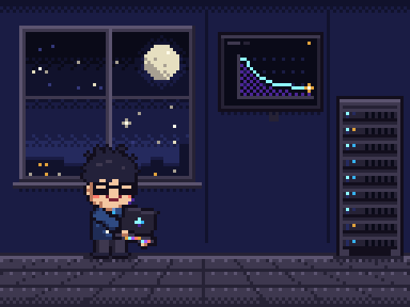

**University of Eastern Finland · Center for Photonics Sciences**

 

 

 

  
   
  <!-- ⚡ <i>Simulating late-night model training, loss convergence, and GPU compute</i> -->

 

---

## About

I am a **Postdoctoral Researcher at the University of Eastern Finland (UEF), Center for Photonics Sciences**. I work at the intersection of **machine learning, optical & THz spectroscopy, computational photonics, inverse problems, and uncertainty-aware AI**.

My research focuses on **THz and Raman data analysis, transfer-matrix-model (TMM) optimisation, inverse reconstruction, spectral modelling, uncertainty quantification (conformal prediction), and TEM image analysis**. In addition to theoretical and experimental modelling, I engineer **reproducible, high-performance research software** for GPU and HPC environments (such as CINECA supercomputers).

Previously, during my PhD, I investigated **handwriting-based biomarkers for neurological screening (Alzheimer's disease)**, combining deep learning, Bayesian classifier fusion, evolutionary computation, multimodal learning, and explainable AI.

> **Research mission:** Develop machine-learning systems that are not only accurate, but measurable, reproducible, uncertainty-aware, and trustworthy in scientific practice.

 

---

## Research snapshot

<table>
<tr>
<td width="50%" valign="top">

### 📡 Scientific AI & Photonics

- THz & optical spectroscopy modelling
- Raman & spectral data processing
- Computational photonics & optics
- Inverse-problem reconstruction
- Transfer-matrix-model (TMM) optimisation

</td>
<td width="50%" valign="top">

### 🎯 Trustworthy & Reliable ML

- Conformal prediction & coverage guarantees
- Uncertainty quantification (UQ)
- Surrogate-assisted evolutionary algorithms
- Bayesian networks & classifier fusion
- Explainable & multimodal AI (XAI)

</td>
</tr>
<tr>
<td width="50%" valign="top">

### 🔬 Biomedical AI & Vision

- TEM image analysis & morphology measurements
- Stroke-based handwriting biomarkers
- Neurological screening (Alzheimer's detection)
- Multimodal biosignal classification
- Automated feature engineering pipelines

</td>
<td width="50%" valign="top">

### 💻 Research Software Engineering & HPC

- Reproducible ML pipelines (Hydra, MLflow)
- Containerised software (Docker, Singularity)
- CINECA HPC & GPU supercomputing workflows
- Open-source scientific Python libraries
- Rigorous benchmark testing & validation

</td>
</tr>
</table>

 

---

## Current projects & grants

<table>
<tr>
<td width="50%" valign="top">

### 🇪🇺 HERMES
**Horizon Europe · MSCA Staff Exchanges**

Machine learning for THz and optical spectroscopy, transfer-matrix-model optimisation, inverse reconstruction, Raman analysis, and spectral signal processing across an international research consortium.

</td>
<td width="50%" valign="top">

### 🇪🇺 THz-Skin
**Horizon Europe · EIC Pathfinder Open**

Pioneering machine-learning research, THz fingerprint e-library development, scientific data curation, spectral analysis, and high-performance software for THz skin measurement data.

</td>
</tr>
<tr>
<td width="50%" valign="top">

### 🇮🇹 Monozukuri Secondment
**Rome · 2026**

THz-based non-invasive sensing, advanced signal-processing pipelines, feasibility analysis, and industrial-grade measurement validation.

</td>
<td width="50%" valign="top">

### ⚙️ CINECA & CLEPSYDRA
**HPC · Optimisation · Reproducibility**

Large-scale machine-learning and optimization experiments deployed on CINECA supercomputers, numerical studies, reproducible data pipelines, and containerised HPC environments.

</td>
</tr>
</table>

 

---

## Selected research output & citation metrics

<table>
<tr>
<td width="20%" align="center"><h3>26</h3>Google Scholar Works <b>66</b> citations · h-index <b>6</b></td>
<td width="20%" align="center"><h3>18</h3>Scopus Indexed <b>48</b> citations · h-index <b>5</b></td>
<td width="20%" align="center"><h3>9</h3>First-Author Papers</td>
<td width="20%" align="center"><h3>2 🏆</h3>Best Paper Awards</td>
<td width="20%" align="center"><h3>2 🇪🇺</h3>Horizon Europe Grants</td>
</tr>
</table>

### 🏆 Best Paper Awards

<table>
<tr>
<td width="50%" valign="top">

#### 🏆 Best Innovation Paper Award — IEEE CH 2026
**2nd IEEE International Conference on Cyber Humanities**  
*San Servolo Island, Venice, Italy · September 7–9, 2026*

> *“Evaluating Single-Characters for Page Attribution in Digital Palaeography”*  
> **Scotto di Freca A., Nardone E., Fontanella F., De Stefano C., Sietis N.**  
> Awarded by the IEEE CH 2026 Awards Committee & IEEE SMC Society for pioneering research bridging artificial intelligence, image analysis, and the humanities to push the boundaries of digital palaeography.

</td>
<td width="50%" valign="top">

#### 🏆 Best EvoApps Paper Award — EvoStar 2026
**European Conference on the Applications of Evolutionary Computation**  
*EvoStar 2026 · LNCS, pp. 384–401*

> *“Toward Reliable Uncertainty Quantification in Surrogate-Assisted Evolutionary Algorithms via Temporal Conformal Prediction”*  
> **Nardone E.**, et al.  
> Awarded for advancing temporal conformal prediction and distribution-free uncertainty quantification in surrogate-assisted evolutionary optimization.

</td>
</tr>
</table>

### Selected publications

- D'Alessandro T., Scotto di Freca A., **Nardone E.**, Fontanella F., De Stefano C., Sietis N. (2026). *Evaluating Single-Characters for Page Attribution in Digital Palaeography*. **2nd IEEE International Conference on Cyber Humanities (IEEE CH 2026)**, Venice, Italy. **🏆 Best Innovation Paper Award.**
- **Nardone E.**, D'Alessandro T., Cilia N.D., Fontanella F. (2026). *Artificial Intelligence for Alzheimer's disease screening via handwriting images acquired by smartphones*. **Engineering Applications of Artificial Intelligence (Elsevier)**, 182:116023. [[DOI: 10.1016/j.engappai.2026.116023](https://doi.org/10.1016/j.engappai.2026.116023)]
- **Nardone E.**, et al. (2026). *Toward Reliable Uncertainty Quantification in Surrogate-Assisted Evolutionary Algorithms via Temporal Conformal Prediction*. **EvoApplications 2026, Lecture Notes in Computer Science (LNCS)**, 14634:384–401. **🏆 Best EvoApps Paper Award.** [[DOI: 10.1007/978-3-032-23604-3_24](https://doi.org/10.1007/978-3-032-23604-3_24)]
- **Nardone E.**, D'Alessandro T., Cilia N.D., Fontanella F. (2025). *Handwriting strokes as biomarkers for Alzheimer's disease prediction: A novel machine learning approach*. **Computers in Biology and Medicine**, 190:110039. [[DOI: 10.1016/j.compbiomed.2025.110039](https://doi.org/10.1016/j.compbiomed.2025.110039)]
- **Nardone E.**, D'Alessandro T., De Stefano C., Fontanella F., Scotto di Freca A. (2025). *A Bayesian network combiner for multimodal handwriting analysis in Alzheimer's disease detection*. **Pattern Recognition Letters**, 190:177–184. [[DOI: 10.1016/j.patrec.2025.02.019](https://doi.org/10.1016/j.patrec.2025.02.019)]
- **Nardone E.**, D'Alessandro T., De Stefano C., Fontanella F. (2025). *How Data Augmentation Affects Evolutionary Algorithms in Feature Selection: An Experimental Study*. **SN Computer Science**, 6(5):536. [[DOI: 10.1007/s42979-025-04049-3](https://doi.org/10.1007/s42979-025-04049-3)]
- **Nardone E.**, et al. (2026). *Compact and Interpretable Binary Classification with SLIM Geometric Semantic Genetic Programming*. [[SSRN Preprint](https://doi.org/10.2139/ssrn.7231540)]

  
  
  
  

 

---

## Featured repositories & open-source software

<table>
<tr>
<td width="50%" valign="top">

### 🧬 [SLIM-GSGP (`slim_v2`)](https://github.com/Narden91/slim_v2)

The first Python library implementing **SLIM Geometric Semantic Genetic Programming (SLIM-GSGP)** — generating compact, highly interpretable symbolic models with state-of-the-art performance.

`Python` · `Genetic Programming` · `Evolutionary Computation` · `Interpretable AI`

</td>
<td width="50%" valign="top">

### 🔗 [Bayesian Combining](https://github.com/Narden91/bayesian-combining)

Bayesian-network classifier fusion, multimodal model stacking, feature importance evaluation, and Bayesian hyperparameter optimisation (*Pattern Recognition Letters 2025*).

`Python` · `Bayesian Networks` · `Optuna` · `Multimodal Fusion`

</td>
</tr>
<tr>
<td width="50%" valign="top">

### 🧠 [Deep Handwriting AI](https://github.com/Narden91/DL_approach_handwriting)

Deep-learning architectures for dynamic sensor & stroke classification, featuring Recurrent models, 1D/2D CNNs, and Transformer-based attention mechanisms for biomarker detection.

`PyTorch` · `Lightning` · `Hydra` · `Docker`

</td>
<td width="50%" valign="top">

### ✍️ [Handwriting Fractal Analyzer](https://github.com/Narden91/Handwriting_fractal_analysis)

High-throughput morphological and multiscale analysis toolkit: computes fractal dimension, lacunarity, multifractal spectra, and topological descriptors from handwriting images.

`Python` · `OpenCV` · `NumPy` · `scikit-learn` · `Hydra`

</td>
</tr>
</table>

  

 

---

## Technical toolbox

<b>Machine learning, deep learning & uncertainty</b>

 

**Core Methodologies:** Conformal Prediction · Temporal Uncertainty Quantification · Evolutionary Algorithms · Genetic Programming (SLIM-GSGP) · Bayesian Networks & Classifier Ensembles · Explainable AI (XAI) · Multimodal Learning

<b>Scientific computing & data analysis</b>

 

**Domains:** THz & Raman Spectral Analysis · Transfer-Matrix Method (TMM) · Inverse Problem Solving · TEM Micrograph Analysis · Lacunarity & Fractal Analysis

<b>Languages, systems & HPC engineering</b>

 

**HPC & Platforms:** CINECA Supercomputing Clusters (Leonardo/Galileo) · Slurm Workload Manager · GPU-accelerated computing · Containerized scientific environments

 

---

## Academic & professional path

```mermaid
timeline
    title Academic and Professional Path
    2021 : MSc Software Engineering
         : 110/110 summa cum laude
         : University of Cassino and Southern Lazio
    2021-2022 : Research Fellow
              : Handwriting ML and acquisition software
    2022-2026 : PhD in Artificial Intelligence
              : University of Cassino and Southern Lazio
    2024 : Visiting PhD Researcher
         : NOVA IMS, Universidade NOVA de Lisboa
    2024-2025 : Adjunct Assistant Professor in AI
              : MSc Software Engineering
    2026-now : Postdoctoral Researcher
             : University of Eastern Finland
             : HERMES & THz-Skin Projects
```

<b>Awards, academic service & teaching</b>

 

| Category | Details |
|---|---|
| 🏆 **Awards** | **Best Innovation Paper Award** — IEEE CH 2026 (San Servolo, Venice)   **Best EvoApps Paper Award** — EvoStar 2026 |
| 🎤 **Workshop Chair** | **BIOMAP** @ ICPR 2026 |
| 🌐 **Conference organisation** | International Conference on Nano-, Tera-, and Bio-Photonics 2026, Joensuu |
| 📝 **Journal reviewing** | Springer Nature AI Journal · Intelligence-Based Medicine · Engineering Applications of Artificial Intelligence (EAAI) · Applied Soft Computing · Scientific Reports |
| 🔍 **Conference reviewing** | GECCO 2026 · PPSN 2026 · BIOMAP/AHIA @ ICPR 2026 · MCMI @ ICPR 2024 |
| 👨‍🏫 **University Teaching** | Adjunct Assistant Professor in Artificial Intelligence (MSc Software Engineering) |
| 🎓 **Training & Outreach** | IEEE Trainer for Europe · Generative AI Tutor |
| 🧑‍🔬 **Supervision & Mentoring** | UEF Summer Internship Supervisor (2026) |

 

---

## GitHub activity

<!-- Deliberately keep ONE GitHub activity/streak-style card only. -->

  

 

---

## Certifications

 

---

## Let's collaborate

I am actively interested in joint research, academic partnerships, and research engineering collaborations in:
**AI for spectroscopy, computational photonics, uncertainty-aware machine learning, inverse problems, evolutionary computation, biomedical AI, and reproducible scientific software**.

AI research · computational photonics · reproducible machine learning

