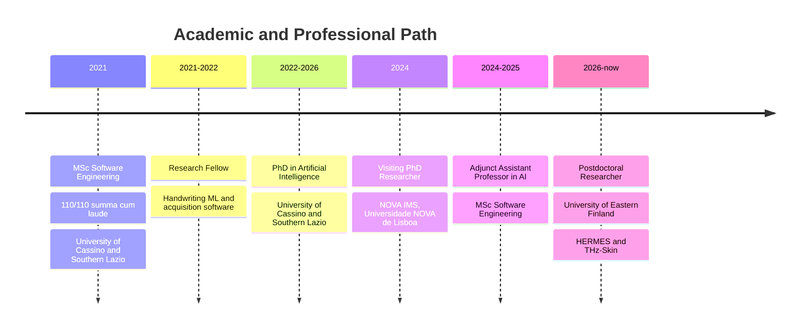

 

 

<!--
Publication-counting convention, verified against the 2026 MSCA CV:
- Peer-reviewed: 5 journal items (including 1 accepted article) + 5 conference proceedings = 10.
- First-author peer-reviewed: 3 journal items + 4 conference proceedings = 7.
- 1 submitted manuscript and 3 preprints/open outputs are intentionally excluded from the headline count.
-->

## About

I am a **Postdoctoral Researcher at the University of Eastern Finland (UEF), Center for Photonics Sciences**, working at the intersection of **artificial intelligence, computational photonics, spectroscopy, and scientific software**.

My current research applies machine learning and deep learning to **optical and THz data**, including **transfer-matrix-model optimisation**, **inverse-problem reconstruction**, **Raman analysis**, **spectral modelling**, and **uncertainty quantification**. In 2026, I also work on industrial THz biosensing through a UEF-funded secondment at **Monozukuri S.p.A.**

My doctoral research focused on **AI-based biomarkers for neurodegenerative-disease screening from handwriting**, combining machine learning, evolutionary computation, Bayesian classifier fusion, deep learning, and explainable AI.

> I am particularly interested in research where reliable AI has to interact with noisy measurements, physical constraints, limited data, and real deployment requirements.

## Current research

<table>
<tr>
<td width="50%" valign="top">

### Scientific focus

- **Computational photonics**
- **THz & optical spectroscopy**
- **Inverse problems & reconstruction**
- **Raman spectral analysis**
- **Uncertainty quantification**
- **Conformal prediction**
- **Evolutionary optimisation**
- **Computer vision / TEM analysis**

</td>
<td width="50%" valign="top">

### Transferable AI expertise

- **Healthcare & biomedical AI**
- **Handwriting biomarkers**
- **Explainable AI**
- **Bayesian networks & multimodal fusion**
- **Genetic algorithms / genetic programming**
- **Reproducible ML pipelines**
- **Agentic AI / LLM systems**
- **Scientific HPC workflows**

</td>
</tr>
</table>

## Research projects

| Project | Programme | Contribution |
|---|---|---|
| **HERMES** | Horizon Europe MSCA Staff Exchanges | ML/DL for THz and optical data, spectral analysis, optimisation and inverse reconstruction |
| **THz-Skin** | Horizon Europe EIC Pathfinder Open | AI/ML contribution, data management and THz fingerprint e-library development |
| **Monozukuri industrial secondment** | UEF / HERMES | THz-based non-invasive glucose-sensing feasibility and AI/ML signal-processing workflows |
| **MEATIC / CINECA HPC** | EUROfusion / CINECA | ML, optimisation and numerical research workloads on national HPC infrastructure |
| **CLEPSYDRA** | Interreg Euro-MED | Reproducible end-to-end data-ingestion and machine-learning software platform |

## Research track record

| 10 | 7 | 2026 | 2026 |
|:---:|:---:|:---:|:---:|
| **Peer-reviewed publications** | **First-author peer-reviewed** | **Best EvoApps Paper Award** | **BIOMAP @ ICPR Workshop Chair** |

The publication count above is deliberately conservative: it includes **5 journal items and 5 peer-reviewed conference proceedings**. A submitted manuscript and preprints/open outputs are tracked separately rather than mixed into the peer-reviewed total.

### Selected publications

- **Nardone E.**, D'Alessandro T., Cilia N.D., Fontanella F. (2025). *Handwriting strokes as biomarkers for Alzheimer's disease prediction*. **Computers in Biology and Medicine**, 190:110039. [DOI](https://doi.org/10.1016/j.compbiomed.2025.110039)
- **Nardone E.**, D'Alessandro T., De Stefano C., Fontanella F., Scotto di Freca A. (2025). *A Bayesian network combiner for multimodal handwriting analysis in Alzheimer's detection*. **Pattern Recognition Letters**, 190:177-184. [DOI](https://doi.org/10.1016/j.patrec.2025.02.019)
- **Nardone E.**, D'Alessandro T., De Stefano C., Fontanella F. (2025). *How Data Augmentation Affects Evolutionary Algorithms in Feature Selection*. **SN Computer Science**, 6(5):536.
- **Nardone E. et al.** (2026). *Toward Reliable Uncertainty Quantification in Surrogate-Assisted Evolutionary Algorithms via Temporal Conformal Prediction*. **EvoApplications 2026, LNCS**, 384-401 — **Best EvoApps Paper Award**.

## Academic & professional path

```mermaid
timeline
    title Academic and Professional Path
    2021 : MSc Software Engineering
         : 110/110 summa cum laude
         : University of Cassino and Southern Lazio
    2021-2022 : Research Fellow
              : Handwriting ML and acquisition software
    2022-2026 : PhD in Artificial Intelligence
              : University of Cassino and Southern Lazio
    2024 : Visiting PhD Researcher
         : NOVA IMS, Universidade NOVA de Lisboa
    2024-2025 : Adjunct Assistant Professor in AI
              : MSc Software Engineering
    2026-now : Postdoctoral Researcher
             : University of Eastern Finland
             : HERMES and THz-Skin
```

## Awards, service & mentoring

- **Best EvoApps Paper Award — EvoStar 2026**, Toulouse
- **Workshop Chair — BIOMAP @ ICPR 2026**
- **Local Organising Committee — International Conference on Nano-, Tera-, and Bio-Photonics 2026**, Joensuu
- **Journal reviewer:** Discover Artificial Intelligence, Intelligence-Based Medicine, Engineering Applications of Artificial Intelligence, Applied Soft Computing, Scientific Reports
- **Conference reviewer:** GECCO 2026, PPSN 2026, BIOMAP/AHIA @ ICPR 2026, MCMI @ ICPR 2024
- **IEEE Trainer for Europe — 2024**
- **UEF Summer Internship Supervisor — 2026**
- **Generative AI course tutor — 2025**

## Technical stack

<b>AI / ML / Scientific Computing</b>

 

**Methods:** evolutionary computation · genetic programming · Bayesian networks · conformal prediction · uncertainty quantification · SHAP/XAI · multimodal learning

<b>Programming & Research Software</b>

 

<b>Infrastructure, HPC & Agentic AI</b>

 

**Infrastructure:** Docker · Kubernetes/GPU orchestration · Linux · CINECA HPC · reproducible ML workflows

## GitHub activity

<!--
The previous streak-stats.demolab.com badge was returning:
"Failed to retrieve contributions. This is likely a GitHub API issue."
It has therefore been removed rather than displaying a broken or unverifiable streak number.

The contribution visualisations below are dynamic. GitHub's contribution graph should be treated
as the source of truth for contribution-day counting.
-->

 

 

> **About streaks:** I do not hard-code a streak number in this README. A streak is only meaningful if it is computed from GitHub's contribution data, and third-party streak services can lag, rate-limit, or fail. The activity graph above updates dynamically and avoids reporting a stale number.

## Certifications

## Collaboration

I am open to research collaborations involving:

**AI for spectroscopy · computational photonics · uncertainty-aware ML · inverse problems · evolutionary computation · healthcare AI · explainable AI · scientific software**

 

