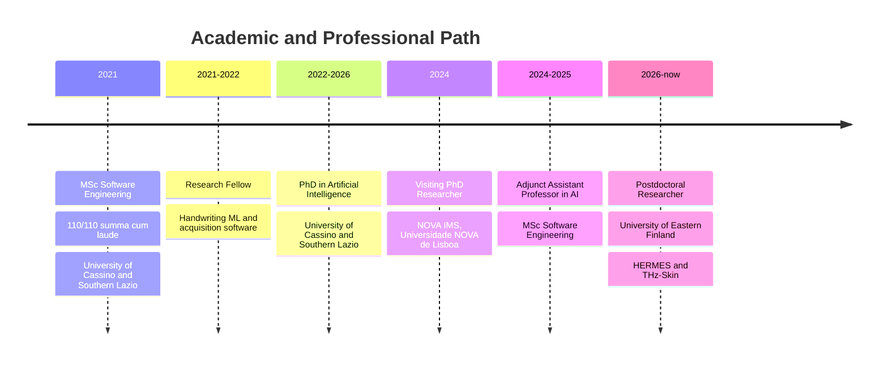

**University of Eastern Finland · Center for Photonics Sciences**

 

 

 

---

## About

I am a **Postdoctoral Researcher at the University of Eastern Finland (UEF), Center for Photonics Sciences**. I work at the intersection of **machine learning, spectroscopy, computational photonics, inverse problems, and uncertainty-aware AI**.

My current research includes **THz and Raman data analysis, transfer-matrix-model optimisation, inverse reconstruction, spectral modelling, uncertainty quantification, and TEM image analysis**. I also develop **reproducible research software** for machine-learning and HPC workflows.

During my PhD, I investigated **handwriting-based biomarkers for neurological screening**, combining deep learning, Bayesian classifier fusion, evolutionary computation, multimodal learning, and explainable AI.

> **Research goal:** build machine-learning systems that are not only accurate, but measurable, reproducible, and useful in scientific practice.

 

---

## Research snapshot

<table>
<tr>
<td width="50%" valign="top">

### 📡 Scientific AI

- THz & optical spectroscopy
- Raman and spectral analysis
- Computational photonics
- Inverse-problem reconstruction
- Transfer-matrix-model optimisation

</td>
<td width="50%" valign="top">

### 🎯 Reliable machine learning

- Conformal prediction
- Uncertainty quantification
- Model reliability & testing
- Evolutionary optimisation
- Explainable & multimodal AI

</td>
</tr>
<tr>
<td width="50%" valign="top">

### 🔬 Vision & biomedical AI

- TEM image analysis
- Morphology measurements
- Handwriting biomarkers
- Neurological screening
- Automated image processing

</td>
<td width="50%" valign="top">

### 💻 Research engineering

- Reproducible ML pipelines
- Containerised software
- GPU/HPC experimentation
- Scientific data workflows
- Research software development

</td>
</tr>
</table>

 

---

## Current projects

<table>
<tr>
<td width="50%" valign="top">

### 🇪🇺 HERMES
**Horizon Europe · MSCA Staff Exchanges**

Machine learning for THz and optical data, transfer-matrix-model optimisation, inverse reconstruction, Raman analysis, and spectral data processing.

</td>
<td width="50%" valign="top">

### 🇪🇺 THz-Skin
**Horizon Europe · EIC Pathfinder Open**

Machine-learning research, THz fingerprint e-library development, data curation, spectral analysis, and software for THz measurement data.

</td>
</tr>
<tr>
<td width="50%" valign="top">

### 🇮🇹 Monozukuri secondment
**Rome · 2026**

THz-based non-invasive glucose sensing, signal-processing pipelines, feasibility analysis, and work with industrial measurement requirements.

</td>
<td width="50%" valign="top">

### ⚙️ CINECA & CLEPSYDRA
**HPC · optimisation · reproducibility**

Machine-learning and optimisation experiments on CINECA systems, numerical studies, reproducible ingestion pipelines, and containerised research software.

</td>
</tr>
</table>

 

---

## Selected research output

<table>
<tr>
<td width="25%" align="center"><b>10</b> Peer-reviewed publications</td>
<td width="25%" align="center"><b>7</b> First-author papers</td>
<td width="25%" align="center"><b>1</b> Best paper award</td>
<td width="25%" align="center"><b>2</b> Horizon Europe projects</td>
</tr>
</table>

### 🏆 Best EvoApps Paper Award — EvoStar 2026

*Toward Reliable Uncertainty Quantification in Surrogate-Assisted Evolutionary Algorithms via Temporal Conformal Prediction.*

### Selected publications

- **Nardone E.**, D'Alessandro T., Cilia N.D., Fontanella F. (2025). *Handwriting strokes as biomarkers for Alzheimer's disease prediction*. **Computers in Biology and Medicine**, 190:110039.
- **Nardone E.**, D'Alessandro T., De Stefano C., Fontanella F., Scotto di Freca A. (2025). *A Bayesian network combiner for multimodal handwriting analysis in Alzheimer's detection*. **Pattern Recognition Letters**, 190:177–184.
- **Nardone E.**, D'Alessandro T., De Stefano C., Fontanella F. (2025). *How Data Augmentation Affects Evolutionary Algorithms in Feature Selection*. **SN Computer Science**, 6(5):536.
- **Nardone E. et al.** (2026). *Toward Reliable Uncertainty Quantification in Surrogate-Assisted Evolutionary Algorithms via Temporal Conformal Prediction*. **EvoApplications 2026, LNCS**, 384–401. **Best EvoApps Paper Award.**

  
  

 

---

## Selected repositories

<table>
<tr>
<td width="33%" valign="top">

### ✍️ [Handwriting Fractal Analyzer](https://github.com/Narden91/Handwriting_fractal_analysis)

Fractal, lacunarity, multifractal, directional, topological, and morphological measurements from handwriting images.

`Python` · `OpenCV` · `NumPy` · `scikit-learn` · `Hydra`

</td>
<td width="33%" valign="top">

### 🔗 [Bayesian Combining](https://github.com/Narden91/bayesian-combining)

Bayesian-network model stacking, feature-importance analysis, and hyperparameter optimisation.

`Python` · `Bayesian Networks` · `Optuna` · `Explainability`

</td>
<td width="33%" valign="top">

### 🧠 [Deep Handwriting AI](https://github.com/Narden91/DL_approach_handwriting)

Deep-learning models for handwriting classification, including recurrent, Transformer, and attention-based architectures.

`PyTorch` · `Lightning` · `Hydra` · `Docker`

</td>
</tr>
</table>

  

 

---

## Technical toolbox

<b>Machine learning & scientific computing</b>

 

**Methods:** evolutionary computation · genetic programming · Bayesian networks · conformal prediction · uncertainty quantification · explainable AI · multimodal learning

<b>Programming & research computing</b>

 

**Systems:** CINECA HPC · GPU computing · containers · Linux · reproducible machine-learning workflows

 

---

## Academic & professional path

```mermaid
timeline
    title Academic and Professional Path
    2021 : MSc Software Engineering
         : 110/110 summa cum laude
         : University of Cassino and Southern Lazio
    2021-2022 : Research Fellow
              : Handwriting ML and acquisition software
    2022-2026 : PhD in Artificial Intelligence
              : University of Cassino and Southern Lazio
    2024 : Visiting PhD Researcher
         : NOVA IMS, Universidade NOVA de Lisboa
    2024-2025 : Adjunct Assistant Professor in AI
              : MSc Software Engineering
    2026-now : Postdoctoral Researcher
             : University of Eastern Finland
             : HERMES and THz-Skin
```

<b>Awards, academic service & teaching</b>

 

| Role | Activity |
|---|---|
| 🏆 **Award** | Best EvoApps Paper Award — EvoStar 2026 |
| 🎤 **Workshop Chair** | BIOMAP @ ICPR 2026 |
| 🌐 **Conference organisation** | International Conference on Nano-, Tera-, and Bio-Photonics 2026, Joensuu |
| 📝 **Journal reviewing** | Springer Nature AI journal · Intelligence-Based Medicine · Engineering Applications of Artificial Intelligence · Applied Soft Computing · Scientific Reports |
| 🔍 **Conference reviewing** | GECCO 2026 · PPSN 2026 · BIOMAP/AHIA @ ICPR 2026 · MCMI @ ICPR 2024 |
| 👨‍🏫 **Teaching** | Adjunct Assistant Professor in Artificial Intelligence |
| 🎓 **Training** | IEEE Trainer for Europe · Generative AI Tutor |
| 🧑‍🔬 **Mentoring** | UEF Summer Internship Supervisor — 2026 |

 

---

## GitHub activity

<!-- Deliberately keep ONE GitHub activity/streak-style card only. -->

  

 

---

## Certifications

 

---

## Let's collaborate

I am interested in joint research on **AI for spectroscopy, computational photonics, uncertainty-aware machine learning, inverse problems, evolutionary computation, biomedical AI, explainable AI, and scientific software**.

AI research · scientific software · reproducible machine learning

