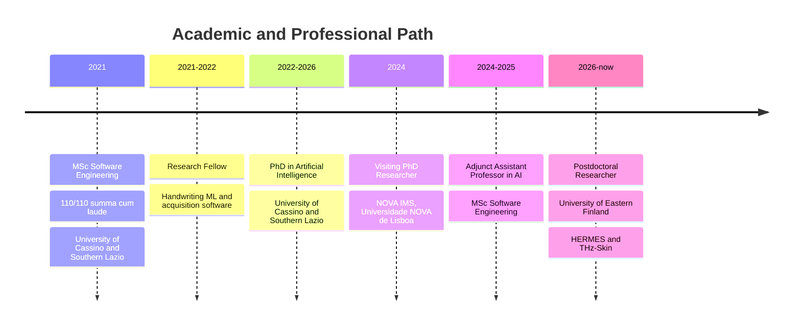

<table>
<tr>
<td width="150">

</td>
<td>

# Emanuele Nardone

**Postdoctoral Researcher in Artificial Intelligence and Machine Learning**  
University of Eastern Finland · Center for Photonics Sciences

**Research:** computational photonics · THz and Raman spectroscopy · inverse problems · uncertainty quantification · evolutionary computation · biomedical AI

</td>
</tr>
</table>

---

## 👤 Profile

I am a **Postdoctoral Researcher at the University of Eastern Finland (UEF), Center for Photonics Sciences**. My work combines machine learning with optical and THz measurements.

My current research covers **inverse-problem reconstruction, transfer-matrix-model optimisation, Raman analysis, spectral modelling, uncertainty quantification, and machine learning for THz data**.

I also work on **TEM image analysis, evolutionary optimisation, and reproducible research software**. During my PhD, I studied **handwriting-based markers for neurological screening**, using machine learning, Bayesian classifier fusion, deep learning, evolutionary computation, and explainable AI.

---

## 🔬 Research areas

| Area | Current work |
|---|---|
| 📡 **THz & optical spectroscopy** | Machine learning for spectral data, THz sensing, Raman analysis, and optical measurements |
| 🎯 **Uncertainty & model reliability** | Conformal prediction, uncertainty estimation, model testing, and reliability analysis |
| 🧬 **Evolutionary computation** | Genetic algorithms, genetic programming, feature selection, and surrogate-assisted optimisation |
| 🧠 **Biomedical AI** | Handwriting-based markers, multimodal classification, and explainable models |
| 🔬 **Computer vision** | TEM image analysis, morphology measurements, and automated image processing |
| 💻 **Research software** | Reproducible machine-learning pipelines, containerised software, and HPC experiments |

---

## 🇪🇺 Current projects

<table>
<tr>
<td width="50%">

### HERMES
**Horizon Europe · MSCA Staff Exchanges**

- Machine learning for THz and optical data
- Transfer-matrix-model optimisation
- Inverse reconstruction
- Raman analysis
- Spectral data processing

</td>
<td width="50%">

### THz-Skin
**Horizon Europe · EIC Pathfinder Open**

- Machine-learning research
- THz fingerprint e-library
- Data management and curation
- Spectral data analysis
- Software for THz measurement data

</td>
</tr>
<tr>
<td width="50%">

### Monozukuri secondment
**Rome, Italy · 2026**

- THz-based non-invasive glucose sensing
- Signal-processing pipelines
- Feasibility study
- Work with industrial measurement requirements

</td>
<td width="50%">

### CINECA & CLEPSYDRA

- Machine-learning and optimisation runs on CINECA HPC systems
- Numerical experiments
- Reproducible data-ingestion pipelines
- Containerised research software

</td>
</tr>
</table>

---

## 📊 Research record

| Metric | Number |
|---|---:|
| 📚 Peer-reviewed publications | **10** |
| ✍️ First-author peer-reviewed publications | **7** |
| 🏆 Best paper awards | **1** |
| 🇪🇺 Current Horizon Europe projects | **2** |

**Publication count:** 5 journal items, including one accepted article, plus 5 peer-reviewed conference proceedings. Submitted manuscripts and preprints are not included in the total above.

### 🏆 Award

**Best EvoApps Paper Award — EvoStar 2026, Toulouse**  
*Toward Reliable Uncertainty Quantification in Surrogate-Assisted Evolutionary Algorithms via Temporal Conformal Prediction.*

---

## 📚 Selected publications

- **Nardone E.**, D'Alessandro T., Cilia N.D., Fontanella F. (2025). *Handwriting strokes as biomarkers for Alzheimer's disease prediction*. **Computers in Biology and Medicine**, 190:110039.
- **Nardone E.**, D'Alessandro T., De Stefano C., Fontanella F., Scotto di Freca A. (2025). *A Bayesian network combiner for multimodal handwriting analysis in Alzheimer's detection*. **Pattern Recognition Letters**, 190:177–184.
- **Nardone E.**, D'Alessandro T., De Stefano C., Fontanella F. (2025). *How Data Augmentation Affects Evolutionary Algorithms in Feature Selection*. **SN Computer Science**, 6(5):536.
- **Nardone E. et al.** (2026). *Toward Reliable Uncertainty Quantification in Surrogate-Assisted Evolutionary Algorithms via Temporal Conformal Prediction*. **EvoApplications 2026, LNCS**, 384–401. **Best EvoApps Paper Award.**

---

## 🧪 Selected public repositories

<table>
<tr>
<td width="33%">

### ✍️ [Handwriting Fractal Analyzer](https://github.com/Narden91/Handwriting_fractal_analysis)

Python software for fractal, lacunarity, multifractal, directional, topological, and morphological measurements from handwriting images.

**Stack:** Python · OpenCV · NumPy · scikit-learn · Hydra

</td>
<td width="33%">

### 🔗 [Bayesian Combining](https://github.com/Narden91/bayesian-combining)

Python software for Bayesian-network model stacking, feature-importance analysis, and hyperparameter search.

**Stack:** Python · Bayesian networks · Optuna · explainability tools

</td>
<td width="33%">

### 🧠 [Deep Handwriting AI](https://github.com/Narden91/DL_approach_handwriting)

Deep-learning code for handwriting classification with RNNs, LSTMs, GRUs, Transformers, attention models, and feature analysis.

**Stack:** PyTorch · Lightning · Hydra · Docker

</td>
</tr>
</table>

---

## 🎓 Academic and professional path

```mermaid
timeline
    title Academic and Professional Path
    2021 : MSc Software Engineering
         : 110/110 summa cum laude
         : University of Cassino and Southern Lazio
    2021-2022 : Research Fellow
              : Handwriting ML and acquisition software
    2022-2026 : PhD in Artificial Intelligence
              : University of Cassino and Southern Lazio
    2024 : Visiting PhD Researcher
         : NOVA IMS, Universidade NOVA de Lisboa
    2024-2025 : Adjunct Assistant Professor in AI
              : MSc Software Engineering
    2026-now : Postdoctoral Researcher
             : University of Eastern Finland
             : HERMES and THz-Skin
```

---

## 🏅 Awards, academic service, and teaching

| Role | Activity |
|---|---|
| 🏆 **Award** | Best EvoApps Paper Award — EvoStar 2026 |
| 🎤 **Workshop Chair** | BIOMAP @ ICPR 2026 |
| 🌐 **Conference organisation** | International Conference on Nano-, Tera-, and Bio-Photonics 2026, Joensuu |
| 📝 **Journal reviewing** | Springer Nature AI journal · Intelligence-Based Medicine · Engineering Applications of Artificial Intelligence · Applied Soft Computing · Scientific Reports |
| 🔍 **Conference reviewing** | GECCO 2026 · PPSN 2026 · BIOMAP/AHIA @ ICPR 2026 · MCMI @ ICPR 2024 |
| 👨‍🏫 **Teaching** | Adjunct Assistant Professor in Artificial Intelligence |
| 🎓 **Training** | IEEE Trainer for Europe · Generative AI Tutor |
| 🧑‍🔬 **Mentoring** | UEF Summer Internship Supervisor — 2026 |

---

## 🛠️ Technical skills

### Machine learning and scientific computing

**Methods:** evolutionary computation · genetic programming · Bayesian networks · conformal prediction · uncertainty quantification · explainable AI · multimodal learning

### Programming

### Infrastructure and research computing

**Tools and systems:** CINECA HPC · GPU computing · Docker · Kubernetes · Linux · reproducible machine-learning workflows

---

## 📈 GitHub activity

**Streak count:** I do not show a fixed streak number because third-party streak services can fail or lag behind GitHub contribution data.

---

## 🎖️ Certifications

---

## 📬 Research interests and contact

I am interested in joint research on **AI for spectroscopy, computational photonics, uncertainty-aware machine learning, inverse problems, evolutionary computation, biomedical AI, explainable AI, and scientific software**.

